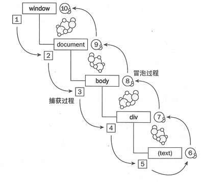

# 一、js事件方法
### 1、onload 和 onUnload
当用户进入或离开页面时就会触发 onload 和 onUnload 事件。

onload 事件常用来检测访问者的浏览器类型和版本，然后根据这些信息载入特定版本的网页。

onload 和 onUnload 事件也常被用来处理用户进入或离开页面时所建立的 cookies。
### 2、onFocus, onBlur 和 onChange
onFocus、onBlur 和 onChange 事件通常相互配合用来验证表单。

例如：用户一旦改变了域的内容，checkEmail() 函数就会被调用。

    <input type="text" size="30" id="email" onchange="checkEmail()">
### 3、onSubmit
onSubmit 用于在提交表单之前验证所有的表单域。

例如：当用户单击表单中的确认按钮时，checkForm() 函数就会被调用。假若域的值无效，此次提交就会被取消。checkForm() 函数的返回值是 true 或者 false。如果返回值为true，则提交表单，反之取消提交。

    <form method="post" action="xxx.htm" onsubmit="return checkForm()">
### 4、onMouseOver 和 onMouseOut
onMouseOver 和 onMouseOut 用来创建“动态的”按钮。

例如：当 onMouseOver 事件被脚本侦测到时，就会弹出一个警告框：

    
# 二、js事件流
</a>
一个完整的JS事件流是从window开始，最后回到window的一个过程。   
事件流被分为三个阶段(1~ 5)捕获阶段、(5~ 6)事件触发阶段、(6~ 10)冒泡阶段。
### 1、捕获阶段（Capture Phase）
事件从文档的根节点出发，随着DOM树的结构向事件的目标节点流去。途中经过各个层次的DOM节点，并在各节点上触发捕获事件，直到到达时间的目标节点。
例如：

    var form=document.querySeletor('form');
    form.addEventListener('click',function(e){
    e.stopPropagation();
    },false); // true表示捕获，false表示冒泡
### 2、触发阶段
当事件到达目标节点时，事件就进入了触发阶段。对于多层嵌套的节点，鼠标和指针事件经常会被定位到最里层的元素上。假设，你在一个div元素上设置了click的监听函数，而用户点击在了这个div元素内部的p元素上，那么p元素就是这个事件的目标元素。事件冒泡让我们可以在这个div或者更上层的元素上监听click事件，并且事件传播过程中触发回调函数。
### 3、冒泡阶段（Bubble Phase）
事件在目标事件上触发后，并不在这个元素上终止。它会随着DOM树一层层向上冒泡，直到到达最外层的根节点，一直向上传播，直到document对象。
# 三、事件代理
在js中经常会遇到以下情况：   
给一个列表的li添加事件，点击某一li时，输出该标签的内容。    
1、 原生写法：

    var ulObj = document.getElementById('list')
    var lis = ulObj.children

    for(var i=0;i<lis.length;i++){
        (function(k){
            lis[k].onclick = function(){
                console.log(lis[k].innerHTML)
                // console.log(k)
            }
        })(i)
        或者：
        lis[i].index = i
        lis[i].onclick = function(){
            var index = this.index
            console.log(lis[index].innerHTML)
        }
    }
    或者：(ES6写法)
    for(let i=0;i<lis.length;i++){
        lis[i].onclick = function(){
            console.log(lis[i].innerHTML)
        }
    }
    
2、事件代理

    var ulObj = document.getElementById('list')
    ulObj.addEventListener('click',function(e){
        let event = e||window.event
        console.log(event.target.innerHTML)
    })
# 四、IE和DOM事件流的区别

    <body> 
        
 
            <button>click</button> 
        
 
    </body> 
冒泡事件模型：button->div->body (***IE事件流***)    
捕获型事件模型：body->div->button (Netscape事件流)   
DOM事件模型：body->div->button->button->div->body (先捕获后冒泡) 
# 五、事件绑定和普通事件的区别
普通添加事件的方法：

    var btn = document.getElementById("hello");
    btn.onclick = function(){
        alert(1);
    }
    btn.onclick = function(){
        alert(2);
    }
    // 执行上面的代码只会alert 2   重叠覆盖

事件绑定方式添加事件：

    var btn = document.getElementById("hello");
    btn.addEventListener("click",function(){
        alert(1);
    },false);         // 冒泡事件
    btn.addEventListener("click",function(){
        alert(2);
    },false);
    // 执行上面的代码会先alert 1 再 alert 2  不会重叠前面的绑定的事件
>总结：   
1、普通添加事件的方法不支持添加多个事件，最下面的事件会覆盖上面的，而事件绑定方式添加事件可以添加多个。   
2、addEventListener不兼容低版本IE。   
3、addEventLisntener还支持事件冒泡+事件捕获。
4、removeEventLIstener取消绑定事件，普通事件无法取消。