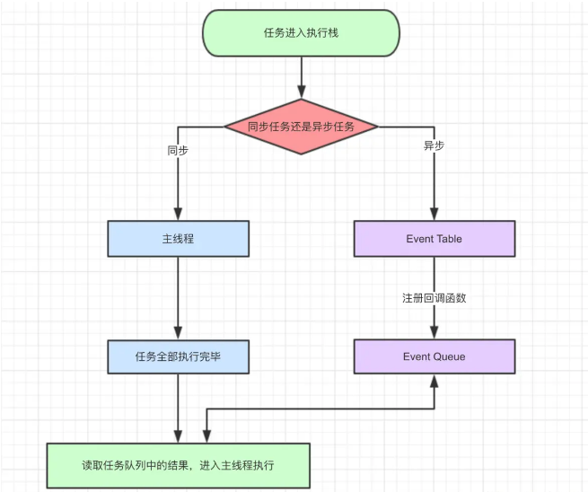
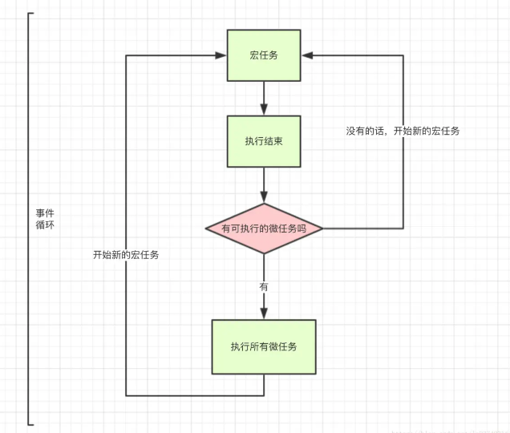

> 引用自https://www.cnblogs.com/lideyao/p/12022717.html
## JavaScript的事件循环

事件循环(Event Loop):同步和异步任务分别进入不同的执行"场所"，同步的进入主线程，异步的进入Event Table并注册函数。当指定的事情完成时，Event Table会将这个函数移入Event Queue。主线程内的任务执行完毕为空，会去Event Queue读取对应的函数，进入主线程执行。上述过程会不断重复，也就是常说的Event Loop(事件循环)。流程可以参考下图。



上面的话里我们需要注意到Event Queue这里是分两种情况的，即宏任务(macrotask)和微任务(microtask)，当主线程任务完成为空去Event Quenu读取函数的时候，是先读取的微任务，当微任务执行完毕之后，才会继续执行宏任务。流程可以参考下图。



所以这个时候可以总结到事件循环中的执行顺序

* 同步 > 异步
* 微任务 > 宏任务

那么微任务和宏任务都有什么呢，简单总结下就是：

* 微任务：Promise，process.nextTick。
* 宏任务：整体代码script，setTimeout，setInterval

## setTimeout、Promise、Async/Await详解
### setTimeout
定时器，可以延迟执行，属于宏任务，在JavaScript事件循环中，执行优先级最低,可以运行下面的代码得到结果
```
console.log('script start')
setTimeout(function(){
    console.log('settimeout')
})
console.log('script end')
//执行结果：   script start ->  script end -> settimeout
```
解析一下上面的代码：

* 同步执行，遇到setTimeout，将其放入异步队列中，跳过继续执行，输出script start -> script end
* 当同步任务队列执行完毕，拿到异步队列中的setTimeout，输出settimeout
> 上面的题可以直接联想到另外一道经典的面试题就是setTimeout(fn,0)的作用和原因?

### Promise
Promise本身是同步的立即执行函数， 当在executor中执行resolve或者reject的时候, 此时是异步操作， 会先执行then/catch等，当主栈完成后，才会去调用resolve/reject中存放的方法执行，打印p的时候，是打印的返回结果，一个Promise实例。resolve函数的作用是，将Promise对象的状态从“未完成”变为“成功”（即从 pending 变为 resolved），在异步操作成功时调用，并将异步操作的结果，作为参数传递出去；reject函数的作用是，将Promise对象的状态从“未完成”变为“失败”（即从 pending 变为 rejected），在异步操作失败时调用，并将异步操作报出的错误，作为参数传递出去。这个时候可以再运行一段代码查看结果
```
console.log('script start')
let promise1 = new Promise(function (resolve) {
    console.log('promise1')
    resolve()
    console.log('promise1 end')
}).then(function () {
    console.log('promise2')
})
setTimeout(function(){
    console.log('settimeout')
})
console.log('script end')

//输出结果：script start->promise1->promise1 end->script end->promise2->settimeout
```
解析一下上面的代码

* 同步执行script start
* 因为Promise本身是同步的立即执行函数，所以输出promise1，resolve()的作用是改变Promise对象的状态，并不会阻断函数的执行，所以会执行输出promise1 end。then方法因为是异步回调微任务，所以会放入到微任务队列中。跳出执行
* 遇到setTimeout，放入宏任务队列，跳过执行。
* 输出script end，同步任务队列执行完毕，然后去微任务队列查看有无执行函数，获得promise1函数的then方法，输出promise2，此时微任务队列为空，然后去宏任务队列查看有无执行方法，输出settimeout。
### async/await
async 函数返回一个 Promise 对象，当函数执行的时候，一旦遇到 await 就会先返回，等到触发的异步操作完成，再执行函数体内后面的语句。可以理解为，是让出了线程，跳出了 async 函数体。可以运行下面的代码查看结果
```
async function async1(){
   console.log('async1 start');
    await async2();
    console.log('async1 end')
}
async function async2(){
    console.log('async2')
}

console.log('script start');
async1();
console.log('script end')

//输出结果：script start->async1 start->async2->script end->async1 end
```
解析一下上面的代码：

* 同步执行，输出script start
* 执行async1()函数，输出async1 start，这是遇到await语句，执行await方法，但是后面的语句放入微任务队列。
* 执行async2()函数，输出async2
* 继续执行同步队列，输出script end。此时同步队列执行完毕，微任务队列查看有无执行函数或方法，输出async1 end
* 此时微任务队列为空，然后去宏任务队列查看有无执行方法。
### 总结
* settimeout的回调函数放到宏任务队列里，等到执行栈清空以后执行； 
* promise.then里的回调函数会放到相应宏任务的微任务队列里，等宏任务里面的同步代码执行完再执行；
* async函数表示函数里面可能会有异步方法，await后面跟一个表达式，async方法执行时，遇到await会立即执行表达式，然后把表达式后面的代码放到微任务队列里，让出执行栈让同步代码先执行。